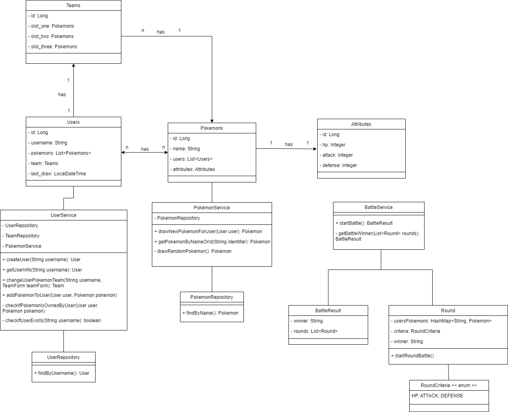

# PokéBattle API
O projeto consiste em batalhas entre times de *Pokémons*, onde cada usuário pode criar um time e batalhar contra outros jogadores. Cada usuário precisa obter seus próprios pokémons, através de um endpoint cuja interação é limitada por tempo. 

> Os dados dos *Pokémons* foram obtidos pela [PokéAPI](https://pokeapi.co).

## Como funciona?
Veja abaixo uma simples explicação dos principais endpoints, e na próxima seção a descrição detalhada de cada um.

A funcionalidade da API é simples: um usuário pode se registrar através do endpoint `/users/register`. Seu nome de usuário pode ser usado para obter novos pokémons, ou para outras pessoas interagirem com seu perfil e batalharem contra você.

Para obter um pokémon use `/pokemons/<NOME DE USUÁRIO>`, e para visualizá-los use `/users/<NOME DE USUÁRIO>`. **Você só pode obter um pokémon a cada 2 minutos**. Cada conta ganha 5 pokémons aleatórios quando é criada. Um time poderá ser formado usando três pokémons diferentes, através do endpoint `/users/<NOME DE USUÁRIO>/team`. 

Para visualizar o perfil público de alguém, use `/users/<NOME DE USUÁRIO>`, onde poderá ver seu time e sua lista de pokémons. Para iniciar uma batalha entre dois jogadores, use `/battle/<NOME DE USUÁRIO>/<NOME DO OUTRO USUÁRIO>`.

## Lista de Endpoints

- [Criação de usuário](#post-usersregister)
- [Ver perfil de usuário](#get-usersnome-de-usuário)
- [Obter novo pokémon](#get-pokemonsnome-de-usuário)
- [Alterar time de pokémons](#put-usersnome-de-usuárioteam)
- [Batalhar contra um usuário](#get-battlenome-de-usuárionome-de-usuário)

### **POST** `/users/register`
Cria um novo usuário.

#### Campos da requisição
- Nome de usuário: `"username": "<nome>"` onde *nome* é formado apenas por letras minúsculas, sem acentos ou espaços, e com tamanho máximo de 20 caracteres.

#### Exemplos
```
POST <URL>/users/register

{
  "username": "aloneinabyss"
}
```

##### Resposta
```
STATUS CODE: 201

{
  "username": "aloneinabyss",
  "pokemons": [
    {
      "id": "35",
      "name": "clefairy",
      "attributes": {
        "hp": "90",
        "attack": "60",
        "defense": "100"
      }
    }
    ...
  ]
```

### **GET** `/users/<NOME DE USUÁRIO>`
Retorna as informações de um usuário.

#### Exemplos
```
GET <URL>/users/aloneinabyss
```

##### Resposta
```
STATUS CODE: 200

{
  "username": "aloneinabyss",
  "pokemons": [
    {
      "id": "35",
      "name": "clefairy",
      "attributes": {
        "hp": "90",
        "attack": "60",
        "defense": "100"
      }
    },
    ...
  ],
  "team": [
    {
      "id": "35",
      "name": "clefairy"
      ...
    },
    ...
  ]
}
```

### **GET** `/pokemons/<NOME DE USUÁRIO>`
Usado para obter um novo pokémon aleatório. Só pode ser chamado a cada 2 minutos por cada usuário.

#### Exemplos
```
GET <URL>/pokemons/aloneinabyss
```

##### Resposta
```
STATUS CODE: 200

{
  "pokemon": {
    "id": "35",
    "name": "clefairy",
    "attributes": {
      "hp": "90",
      "attack": "60",
      "defense": "100"
    }
  }
}
```

### **PUT** `/users/<NOME DE USUÁRIO>/team`
Define qual time de pokémons será usado em batalhas com seu usuário. Um time deve ter obrigatóriamente **três pokémons**.

#### Campos da requisição
- Time: `"team": { "first": "<id | nome>", "second": "<id | nome>", "third": "<id | nome>" }` onde é possível passar o id ou o nome do pokémon desejado para cada posição do time. Só serão aceitos pokémons que o usuário possuir em sua conta.

#### Exemplos
```
PUT <URL>/users/aloneinabyss/team

{
  "first": "clefairy",
  "second": "19",
  "third": "130"
}
```

##### Resposta
```
STATUS CODE: 201

{
  "team": [
    {
      "id": "35",
      "name: "clefairy"
      ...
    },
    ...
  ]
}
```

### **GET** `/battle/<NOME DE USUÁRIO>/<NOME DE USUÁRIO>`
Inicia uma batalha entre dois usuários diferentes. A batalha será realizada entre os times de pokémons de cada usuário. Consiste nas seguintes etapas: cada time possui três slots de pokémons, primeiro os dois pokémons no primeiro slot de cada time são escolhidos para batalhar entre si, então um dos possíveis atributos (**hp**, **attack** ou **defense**) é sorteado para ser o critério de decisão do vencedor do round, em seguida o mesmo acontece com os pokémons do segundo slot, e por fim do terceiro slot. O jogador com mais número de rounds vencidos ganha a batalha.

#### Exemplos
```
GET <URL>/battle/aloneinabyss/devilady
```

##### Resposta
```
STATUS CODE: 200

{
  "battle": {
    "round1": {
      "winner": "aloneinabyss",
      "criteria": "hp",
      "player1": {
        "pokemon": {
          "name": "clefairy",
          ...
        }
      },
      "player2": {
        "pokemon": {
          "name": "rattata",
          ...
        }
      }
    },
    "round2": {
      "winner": "devilady",
      "criteria": "attack",
      "player1": {
        "pokemon": {
          "name": "bulbasaur",
          ...
        }
      },
      "player2": {
        "pokemon": {
          "name": "pikachu",
          ...
        }
      }
    },
    ...
  },
  "winner": "aloneinabyss"
}
```


## Funcionalidades
Planejadas:
- [x] Documentação inicial
- [x] Diagrama de classes
- [ ] Endpoints relacionados aos usuários
- [ ] Endpoints relacionados aos pokémons
- [ ] Endpoints relacionados às batalhas
- [x] Disponibilizar template para usar no Insomnia
- [ ] Hospedar o projeto em nuvem

Desejadas:
- [ ] Histórico de batalhas
- [ ] Habilidades especiais para cada tipo de pokémon
- [ ] Recompensas por vencer batalhas
- [ ] Conquistas para completar
- [ ] Ranking de jogadores
- [ ] Imagem de perfil


## Diagrama de Classes



## Changelog
[Veja aqui o histórico de versões do projeto](/CHANGELOG.md)


## Outras Informações
Só estão disponíveis os pokémons da primeira geração. O projeto é compatível com **Java na versão 11 ou superior**.

Esta é uma REST API desenvolvida durante o curso de Java da **Let's Code**.
